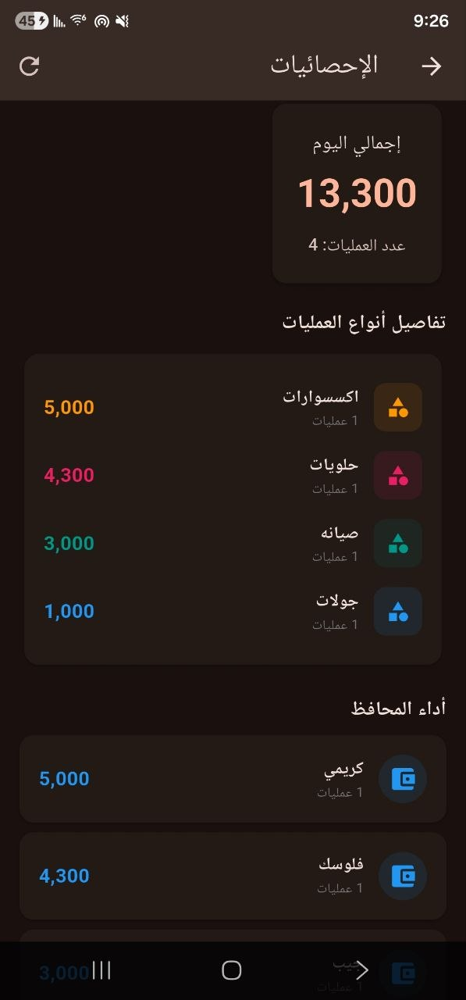
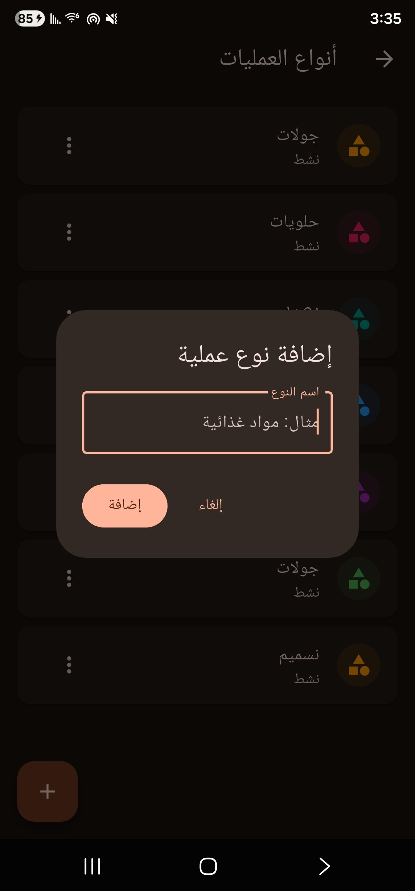
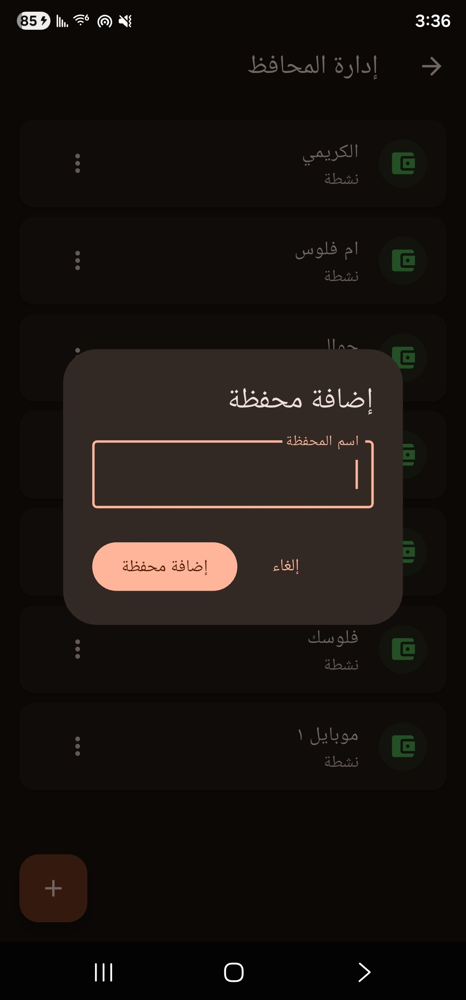
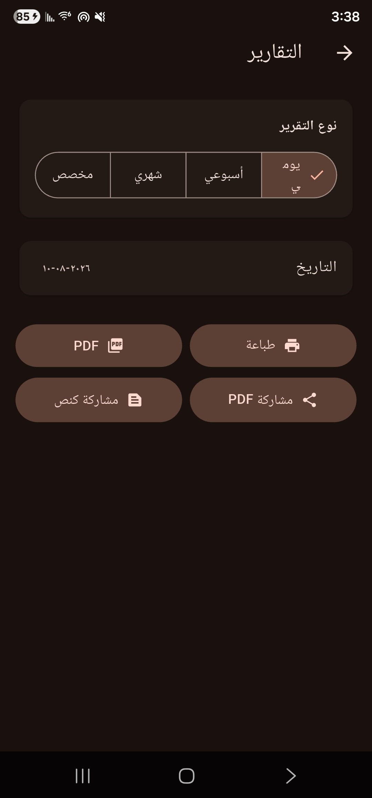
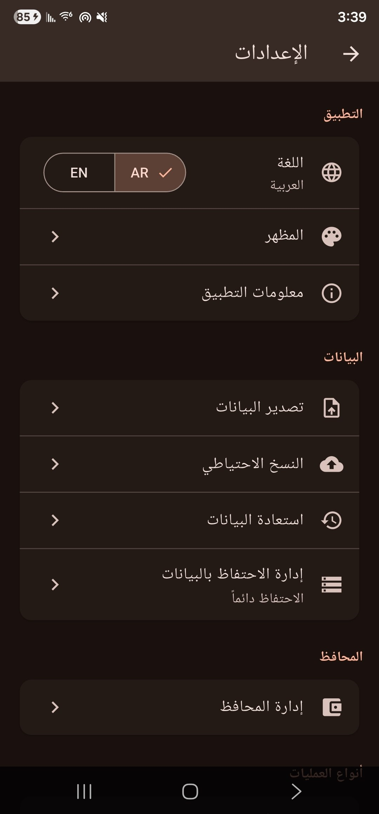
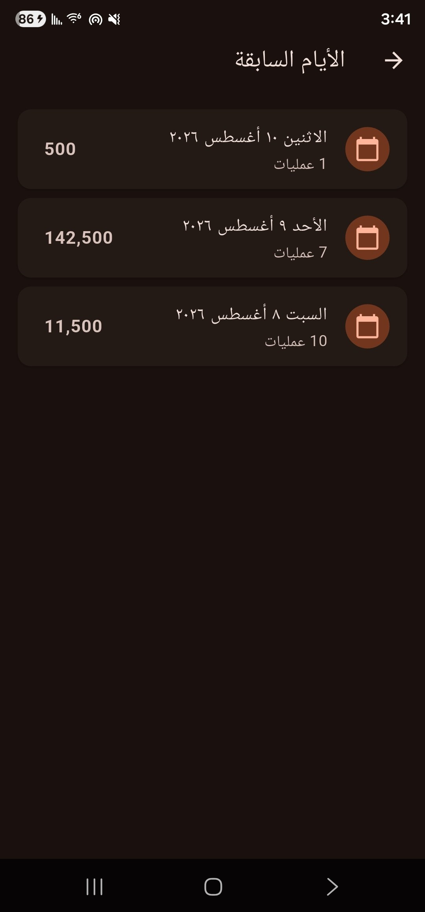

# 💼 Wallet Ledger — مدير المحافظ والمبيعات

<div align="center">

**تطبيق Flutter لإدارة عمليات البيع اليومية والمحافظ الإلكترونية بشكل بسيط، سريع واحترافي.**

[](https://flutter.dev/)
[](https://dart.dev/)
[](https://developer.android.com/)
[](#)

</div>

---

## 📌 نبذة عن المشروع

**Wallet Ledger** هو تطبيق Android مبني باستخدام **Flutter** لإدارة المبيعات والعمليات المالية التي تتم عبر المحافظ الإلكترونية.

فكرة التطبيق بسيطة: بدل تسجيل عمليات اليوم في ورقة، يقوم التطبيق بإنشاء **دفتر يومي رقمي** يحفظ كل عملية مع نوعها، المحفظة المستخدمة، المبلغ، الوقت والملاحظات، ثم يعرض الإحصائيات والتقارير بشكل منظم.

التطبيق مصمم ليكون **عامًا وقابلًا للتخصيص**؛ فهو لا يقتصر على محل حلويات أو سمبوسة، ويمكن لأي نشاط تجاري إنشاء أنواع العمليات التي يحتاجها.

### أمثلة

- 🍰 حلويات
- 🥟 سمبوسة
- 🥛 حليب
- 💧 مياه
- 🛒 مواد غذائية
- 🥤 مشروبات
- 👕 ملابس
- 🔧 خدمات
- ✏️ أي عملية مخصصة يضيفها المستخدم

---

## ✨ أهم المميزات

### 💳 إدارة المحافظ
- إضافة محافظ إلكترونية متعددة.
- تعديل بيانات المحافظ.
- تعطيل أو حذف المحافظ وفقًا لحالة استخدامها.
- حساب إجمالي كل محفظة.
- ربط كل عملية بالمحفظة التي تمت من خلالها.

### 🧾 تسجيل العمليات
كل عملية تحتوي على:
- نوع العملية.
- اسم العملية المخصص عند الحاجة.
- المحفظة.
- المبلغ.
- التاريخ والوقت.
- الملاحظات.

### 🧩 أنواع عمليات قابلة للتخصيص
لا توجد أنواع مبيعات ثابتة داخل النظام.

يأتي التطبيق بأنواع افتراضية، ويمكن للمستخدم:
- إضافة نوع جديد.
- تعديل النوع.
- تعطيله.
- استخدامه في العمليات الجديدة.

وهذا يجعل التطبيق مناسبًا لأي نشاط تجاري.

### 📅 دفتر يومي
كل يوم له سجل مستقل.

عند بدء يوم جديد:
- يتم إنشاء سجل يوم جديد تلقائيًا.
- تبقى بيانات الأيام السابقة محفوظة.
- يمكن الرجوع لأي يوم سابق.
- يمكن مراجعة إجمالي كل يوم.

### 🗃️ الأرشيف
تنظيم البيانات حسب:
- السنة.
- الشهر.
- اليوم.

مع إمكانية البحث والرجوع إلى السجلات القديمة.

### 📊 الإحصائيات والتقارير
- إجمالي اليوم.
- إجمالي العمليات.
- إجمالي كل نوع عملية.
- إجمالي كل محفظة.
- تقارير يومية.
- تقارير أسبوعية.
- تقارير شهرية.
- تقارير بفترة مخصصة.

### 📄 PDF والطباعة
- إنشاء تقارير PDF.
- تصميم مناسب للطباعة على A4.
- مشاركة ملف PDF.
- طباعة التقرير مباشرة.
- دعم العربية والإنجليزية في التقارير.
- استخدام خط عربي مضمّن داخل التطبيق لتجنب مشاكل الحروف والمربعات.

### 📤 المشاركة
يمكن مشاركة:
- ملف PDF.
- التقرير كنص.
- التقارير عبر تطبيقات المشاركة المتوفرة على Android.

### 🌐 تعدد اللغات
- العربية RTL.
- English LTR.

### 🎨 واجهة عصرية
- تصميم Dark Mode.
- واجهة بسيطة وسريعة.
- أقسام منظمة.
- أيقونات واضحة.
- تجربة استخدام مناسبة للأعمال اليومية.

---

## 📱 لقطات الشاشة

> ضع صور التطبيق داخل المجلد:
>
> `assets/screenshots/`

ثم استخدم الأسماء التالية أو عدّلها حسب صورك.

### لوحة التحكم



### تسجيل عملية



### إدارة المحافظ



### الإحصائيات والتقارير



### الإعدادات



### الأرشيف والأيام السابقة



---

## 🏗️ التقنيات المستخدمة

| التقنية | الاستخدام |
|---|---|
| Flutter | بناء التطبيق |
| Dart | لغة البرمجة |
| SQLite / قاعدة البيانات المحلية | تخزين البيانات محليًا |
| Flutter PDF | إنشاء التقارير |
| Printing | الطباعة |
| URL Launcher | فتح الروابط والتواصل |
| Android Share | مشاركة الملفات والتقارير |

> قد تختلف الحزم الفعلية حسب بنية المشروع الحالية. راجع `pubspec.yaml` للحصول على القائمة النهائية.

---

## 📂 بنية المشروع

```text
lib/
├── models/
├── services/
├── database/
├── screens/
├── widgets/
├── reports/
├── settings/
└── main.dart

assets/
└── screenshots/
```

> يتم تعديل أسماء المجلدات أعلاه لتطابق البنية الفعلية للمشروع إذا كانت مختلفة.

---

## 🚀 تشغيل المشروع محليًا

### 1. استنساخ المشروع

```bash
git clone https://github.com/engosamaali7-commits/OQ-Developer.git
cd OQ-Developer
```

### 2. تثبيت الحزم

```bash
flutter pub get
```

### 3. التحقق من المشروع

```bash
flutter analyze
```

### 4. تشغيل التطبيق

```bash
flutter run
```

### 5. إنشاء APK

```bash
flutter build apk --release
```

سيتم إنشاء ملف APK داخل:

```text
build/app/outputs/flutter-apk/release/
```

---

## 🗄️ البيانات والخصوصية

التطبيق مصمم للعمل محليًا، وتتم إدارة بيانات العمليات والمحافظ على الجهاز وفق آلية التخزين المحلية المستخدمة في المشروع.

لا يتم افتراض وجود اتصال دائم بالإنترنت لتسجيل العمليات اليومية.

**مهم:** يوصى بعمل نسخة احتياطية دورية للبيانات المهمة.

---

## 🔄 فكرة العمل

```text
فتح التطبيق
      ↓
اليوم الحالي
      ↓
اختيار نوع العملية
      ↓
اختيار المحفظة
      ↓
إدخال المبلغ
      ↓
إضافة ملاحظة (اختياري)
      ↓
حفظ العملية
      ↓
تحديث الإحصائيات
      ↓
إغلاق اليوم / الانتقال ليوم جديد
      ↓
الأرشيف
      ↓
التقارير
      ↓
PDF / طباعة / مشاركة
```

---

## 🎯 الهدف من المشروع

الهدف من المشروع هو تحويل طريقة تسجيل المبيعات اليومية من **دفتر ورقي** إلى نظام رقمي بسيط يساعد صاحب النشاط التجاري على:

- معرفة إجمالي مبيعاته.
- معرفة حركة كل محفظة.
- معرفة تفاصيل كل يوم.
- الرجوع إلى العمليات القديمة.
- إنشاء تقارير قابلة للطباعة والمشاركة.
- تقليل الأخطاء الناتجة عن الحساب اليدوي.

---

## 🔮 تطويرات مستقبلية

يمكن تطوير المشروع مستقبلًا بإضافة:

- ☁️ مزامنة سحابية اختيارية.
- 👥 تعدد المستخدمين والصلاحيات.
- 📈 رسوم بيانية متقدمة.
- 🔔 تنبيهات يومية.
- 💾 نسخ احتياطي تلقائي.
- 📦 إدارة المخزون.
- 💰 المصروفات والأرباح.
- 🧾 الفواتير.
- 📊 لوحة تحكم متقدمة.
- 🔐 قفل التطبيق برمز PIN أو بصمة.
- 🔄 استيراد وتصدير البيانات.

---

## 👨‍💻 المطور

**أسامة علي**

Software Developer

📱 **Phone:** +967 780 155 801

💬 **WhatsApp:** https://wa.me/967780155801

📢 **WhatsApp Channel:**  
https://whatsapp.com/channel/0029Vb5lkNCKmCPSvOoUOz0M

💻 **GitHub:**  
https://github.com/engosamaali7-commits/OQ-Developer

---

## 📄 الترخيص

إذا لم يتم تحديد License للمشروع بعد، لا تضف ترخيصًا مفتوح المصدر تلقائيًا.

يمكن تحديد الترخيص لاحقًا حسب طريقة نشر المشروع.

---

<div align="center">

### Built with Flutter & Dart ❤️

**Wallet Ledger — Simple. Fast. Organized.**

</div>
